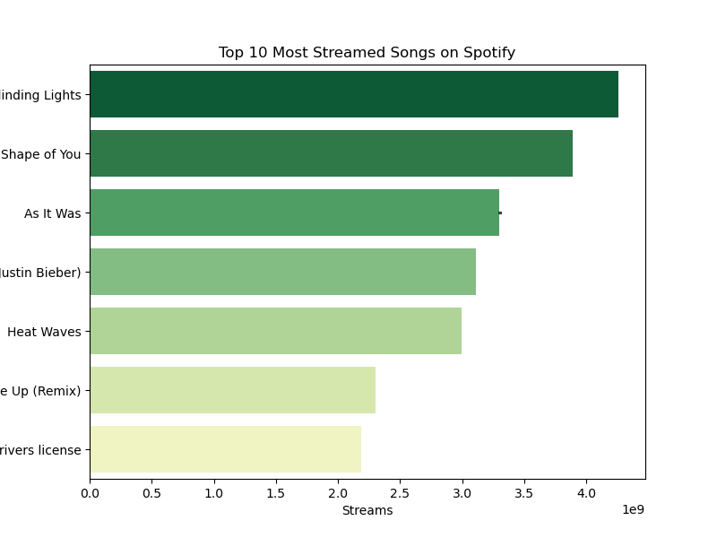
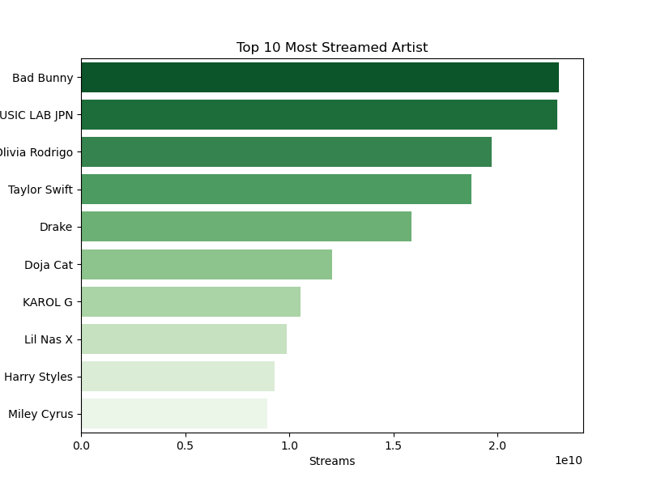
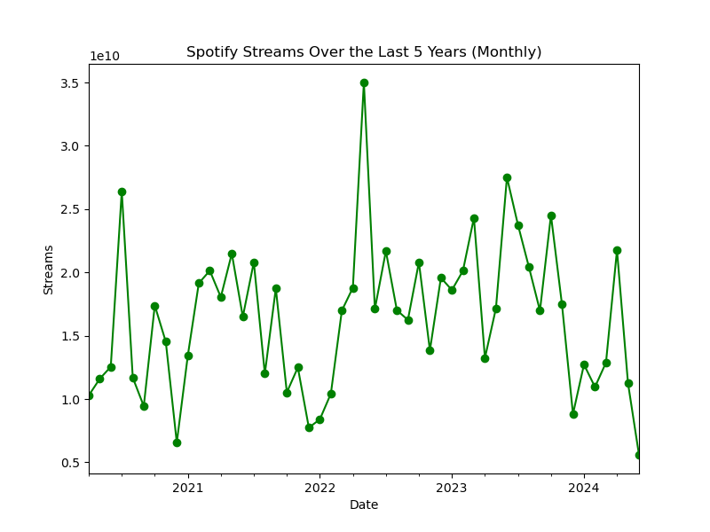
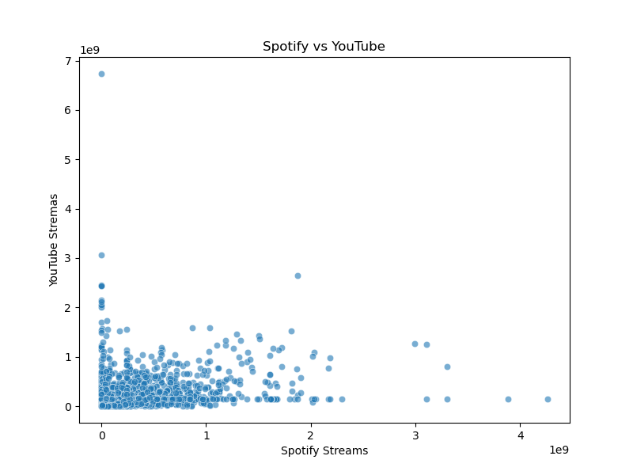
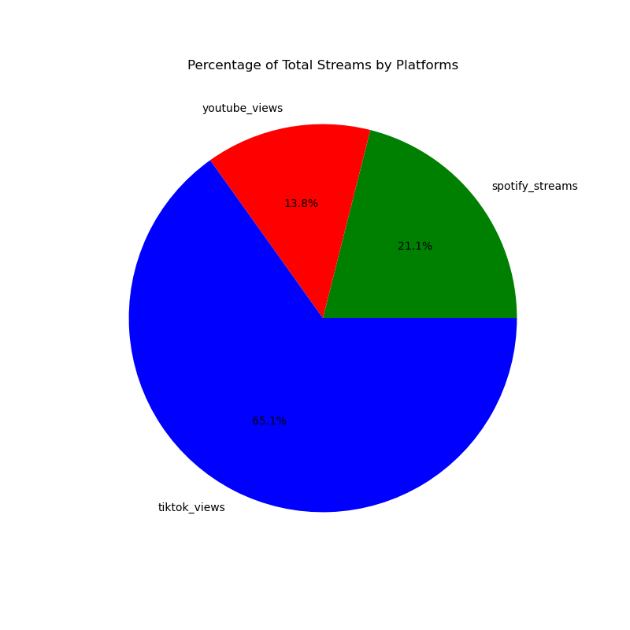

# Spotify Streaming Insights & Strategic Analysis

## Executive Summary
This report provides a comprehensive analysis of Spotify streaming data from the past five years, with a focus on uncovering trends that can support strategic decision-making. Key areas of analysis include top-performing content, seasonal behaviors, cross-platform performance, playlist impact, and TikTok influence.
All insights are tailored to inform content strategy, marketing initiatives, and partnership opportunities for Spotify's, continued platform growth.

---

## Objectives

- Identify top-performing songs, artists, and genres.
- Explore seasonal streaming trends.
- Compare Spotify peformance to competitors like YouTube and TikTok.
- Evaluate the impact of playlists on track popularity.
- Understand how viral content on TikTok translates into Spotify engagement.

---

## Key Insights & Visualizations

### 1. Top Songs and Streaming Trends

***Key Questions:***
- Which songs and artists dominate in Spotify streams?
- Are certain genres or artists consistently popular?
- Do we observe seasonal trends in stream volume?

📊 *Visuals:*
- Bar charts for top 10 songs and artists.
- Monthly streaming trend over the last 5 years.

 **Insight:**
Spotify's top streamed songs over the last five years are driven by high-profile artists in pop, Latin, and rap genres. Notably, artist visibility is amplified through playlist placements and seasonal patterns - with streaming spikes during summer and holidays.

 ### Top 10 Most Streamed Songs

### Top Artists by Total Streams

### Seasonality Trends (Last 5 Years)

### 2. Cross-Platform Streaming Comparison

**Key Questions:**
- Do top Spotify songs also perform well on YouTube or TikTok?
- What's the correlation between Spotify and YouTube views?
- What does platform dominance say about our market position?

📊 *Visuals:*
- Spotify vs YouTube scatter plot
- Total stream comparison by platform
- Correlation metrics

**Insight:**

### Spotify vs. YouTube Streams

### 3. The Impact of Playlsit on Song Popularity

**Key Questions:** 
- Do curated playlists boost streaming performance?
- Are some playlists more influential than others?
- Should we invest more in playlist marketing?

📊 *Visuals:*
- Playlist reach vs stream volume
- Streams grouped by playlist count
- Correlation analysis

### 4. Platform Influence on Artist Success

**Key Questions:**
- Which platform contributes the most to artist exposure?
- Is Spotify still the primary driver of artist success?
- Should we expand collaborations with platforms like TikTok?

📊 *Visuals:*
- Pie chart of total streams by platform 
- Top 10 most streamed artists across all platforms

**Insight:**

### 5. TikTok Virality vs. Spotify Streams

**Key Questions:** 
- Does TikTok virality lead to higher Spotify engagement?
- Are viral hits on TikTok leading to long-term growth?
- What's the ROI of partnering with influencers or TikTok campaigns?

📊 *Visuals:*
- TikTok vs Spotify scatter plot
- Correlation chart
- Viral impact ratio analysis

## Tools Used

- Python (Pandas, Matplotlib, Seaborn)
- Jupyter Notebook
- Data sources from Kaggle: [Most Streamed Spotify Songs 2024]

--- 

## Business Insights
- **Playlist Reach Has a Strong Impact:**
Songs addefd to more playlists had a 0.63 correlation with higher spotify 

## Conclusion 

The analysis confirms several strategic opportunites for Spotify:
- Artists and tracks with multi-platform exposure performs significantly better overall.
- Playlists remain a powerful driver ofuser engagement and discovery.
TikTok virality presents short-term engagement spikes but may not always translate into long-term value.
- There's potential for increased platform partnerships to improve market share and artist support.

---